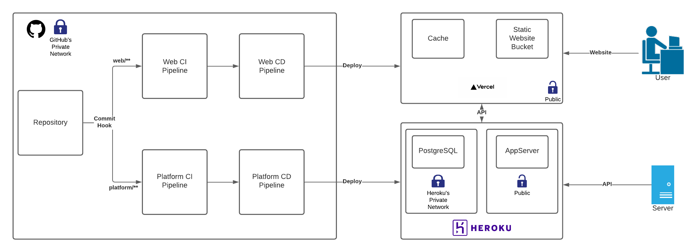

# Topics Project

This project will demo the usage of Github Actions with a [`monorepo`](https://www.atlassian.com/git/tutorials/monorepos). The system consists on two applications, [`web`](./web) and `platform`(./plaform) the front-end and back-end respectively.

# Common

At the top level of the project we will find the following files:

* `README.md` - This
* `.gitignore` - Telling git which files to ignore
* `vercel.json` - Vercel config file
* `.github` - Folder with Github Actions

# Web

Web is a [React](https://github.com/facebook/react) based application. Currently it only contains the starting project created by [`create-react-app`](https://github.com/facebook/create-react-app).
For instructions on usage refer to `create-react-app` [docs](https://github.com/facebook/create-react-app#npm-start-or-yarn-start).

# Platform

Platform is a Python based back-end powered by [FastAPI](https://github.com/tiangolo/fastapi). It contains a few example APIs and it requires the usage of a PostgreSQL database. 

# Infra



# CI/CD

## The `.github` folder

The [`.github`](./.github) folder contains our Github Actions Workflows. Each workflow is defined is it's own `.yml` file.


## Job Overview

Let's take a into the [workflow definition](./.github/workflows/ci-web.yml) for `web`. Following we will define the __name__ of the workflow, __when__ it should run, and on __which__ branch and folder.

```yml
name: Build and Deploy Web App

on:
  # when it should run 
  push: 
    # on which branches
    branches:
      - main  
    # which folder trigger changes
    paths:
      - "web/**"
```

As we are running a monorepo changes will be made to several projects, but we only want to deploy changes when the specific project changes, so in order to get that behaviour we set the `paths` variable. The `paths` variable will make the Workflow only run when changes are made to that specific path.

Now let's define the build job. This will require us to define which OS we need to use, our build steps, if any services are required, among others.

```yaml
# set some default values for all the jobs
defaults:
  run:
    working-directory: ./web

# jobs definition
jobs:

  # name of the job
  build:
  
    # selected OS
    runs-on: ubuntu-latest

    # interpreter versions, will run once for each version 
    # mostly useful for libraries
    strategy:
      matrix:
        node-version: [16.x]

    # our job steps definition
    steps:
      # checkout code with predifined action
      - uses: actions/checkout@v2

      # add interpreter to enviorment with predefined action
      # uses version in matrix
      - name: Use Node.js ${{ matrix.node-version }}
        uses: actions/setup-node@v1
        with:
          node-version: ${{ matrix.node-version }}

      # Project build steps
      - name: Install dependencies
        run: npm install

      - name: Check code format - Prettier
        run: npx prettier --check src

      - name: Run tests
        run: npm test

      - name: Execute build
        run: npm run build
```
If everything with the job is okay, we can move forward with the deployment. For the `web` project, we will be using [Vercel](https://vercel.com). We will only deploy on build success so we will say that this job named `deploy` will need the job `build`. This means that `deploy` will run after `build` is finished and is successful.

In order to deploy to Vercel we will use [Vercel provided deploy action](https://github.com/marketplace/actions/vercel-action). In order to do this we will need to set a few secrets to the actions. We can pass secrets by using the `${{ secret_name }}` notation. Secrets are defined in the settings tab for the project in Github. 

```yml
# define job name
deploy:

  # add dependencies
  needs: build

  # select os
  runs-on: ubuntu-latest

  # define job steps
  steps:
    - uses: actions/checkout@v2
    - uses: amondnet/vercel-action@v20
      with:
        # pass secrets
        vercel-token: ${{ secrets.VERCEL_TOKEN }}
        vercel-org-id: ${{ secrets.ORG_ID}}
        vercel-project-id: ${{ secrets.PROJECT_ID}}
        working-directory: ./web
```

Optionally if needed we can pass services to a job definition, like we do in [platform workflow](./.github/workflows/ci-platform.yml). Here we will use PostgreSQL while running the project build. We are setting username as password so the service is created with that credentials. Also do some port forwarding the PostgreSQL will be listening in port 5432, which will connect to our CI/CD container in the port 5432. This means we can expect the DB to be available at port 5432.

```yml
services:
  postgres:
    image: postgres
      env:
        POSTGRES_USER: postgres
        POSTGRES_PASSWORD: cantguessthis
      ports:
        - 5432:5432
```

[Services](https://docs.github.com/es/actions/guides/about-service-containers) are basically just [Docker](https://www.docker.com/) containers. So you should be able to use any container you want.
